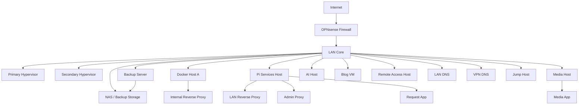

# Public Topology Summary

This is the public-safe topology summary that matches the sanitized Excalidraw template.

## Primary Artifacts

- [HomeLab_OPNsense_PUBLIC_TEMPLATE.png](./HomeLab_OPNsense_PUBLIC_TEMPLATE.png)
- [PUBLIC_TEMPLATE_GUIDE.md](./PUBLIC_TEMPLATE_GUIDE.md)

## Public Architecture At A Glance

## Public Story

- firewall and segmentation are centered on OPNsense
- virtualization and backup are shown as first-class infrastructure
- a main Docker host and a Pi services host split proxy and app roles
- VPN clients use a dedicated DNS path and LAN reverse-proxy path
- the storage and backup story is visible without exposing private identifiers

## Purpose

Use this summary when you want to explain the workflow publicly without exposing private lab details.

The topology image was created in Excalidraw and shared here as a public-safe PNG export rather than as an editable working source file.
