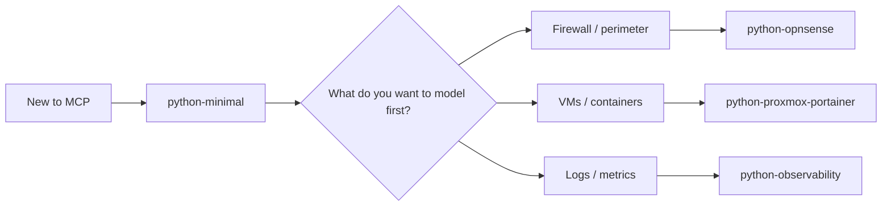

# 🧭 Choose a Starter

This page helps you choose the fastest starting point for your MCP server.

## Quick Recommendation

If you are new to MCP, start with `python-minimal`.

## Starter Flow

## Which Starter Should You Choose?

### Start with `python-minimal` if:

- you are new to MCP server development
- you want the smallest possible runnable example
- you want to learn the FastMCP structure before adding real infrastructure APIs

Use:
- [python-minimal](./python-minimal/README.md)

### Start with `python-opnsense` if:

- your main use case begins at the firewall
- you want to generate firewall summaries, alias maps, or perimeter documentation
- your homelab story is centered on OPNsense migration, audit, or rule visibility

Use:
- [python-opnsense](./python-opnsense/README.md)

### Start with `python-proxmox-portainer` if:

- your main use case is VM/container discovery
- you want to map services across Proxmox and Portainer first
- you want host inventory, container inventory, and service placement to be your first MCP outputs

Use:
- [python-proxmox-portainer](./python-proxmox-portainer/README.md)

### Start with `python-observability` if:

- your main use case is logs, metrics, and service-health visibility
- you want to summarize Prometheus, Loki, or uptime-style data first
- you want troubleshooting and audit context before deeper infrastructure modeling

Use:
- [python-observability](./python-observability/README.md)

## Suggested Adoption Path

1. Start with `python-minimal` if you have never built an MCP server before.
2. Move to `python-opnsense`, `python-proxmox-portainer`, or `python-observability` once you know which system you want to model first.
3. Merge patterns from multiple starters into your real server.

## If You Do Not Want To Build a Custom Server First

Read [Trusted Public MCP Path](../docs/TRUSTED_PUBLIC_MCP_PATH.md) first, then come back here when you are ready to build your own custom server.

## Common Rule Across All Templates

All starters in this repo are intentionally read-only by default.

That means:

- exported sample data first
- live API integration second
- write actions only later with explicit approval patterns
